ST Nucleo L476RG for Thingspace.io
==============================================

Thingspace.io Client and Demo Dashboard for TI LaunchPad CC3200-LAUNCHXL

Demo Dashboard: [https://freeboard.thingspace.io/board/5PzeDm](https://freeboard.thingspace.io/board/5PzeDm)
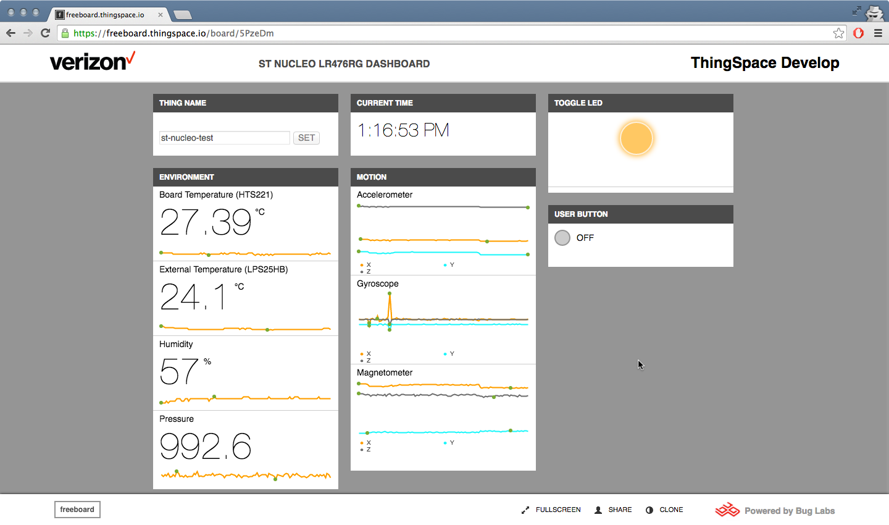

# Table of Contents
*   [Introduction](#introduction)
*   [Programming the Board](#programming-the-board)
*   [Demo Dashboard Usage](#demo-dashboard-usage)
*   [Dashboard Customization](#customizing-the-dashboard)
*   [Additional Resources](#additional-resources)

Introduction
------------
This repository contains firmware and application code to view sensor data and send commands to a ST Nucleo L476RG board, with the X-NUCLEO-IDW01M1 (WiFi) and X-NUCLEO-IKS01A1 sensor boards attached, using Verizon's ThingSpace Device Messaging APIs (thingspace.io) and ThingSpace-Freeboard application enablement tools.

The ST Nucleo L476RG / X-NUCLEO-IDW01M1 / X-NUCLEO-IKS01A1 connects via WiFi to send an assortment of on-board sensor data (including accelerometer, temperature, push buttons, gyroscope, humidity, ambient pressure, magnetometer, and LED) to ThingSpace.  
You can view the live data and send commands to the board (including toggling the LED) from the Demo Dashboard ([https://freeboard.thingspace.io/board/5PzeDm](https://freeboard.thingspace.io/board/5PzeDm))

To get started, you must first program the board with your WiFi and thingspace.io settings.

Programming the Board
---------------------
(Note: The following instructions are for programming using a Windows PC)

Download Tera Term: https://ttssh2.osdn.jp/index.html.en

On the WiFi board, remove resistor R21 (RED) and apply a solder bridge to R20 (YELLOW)
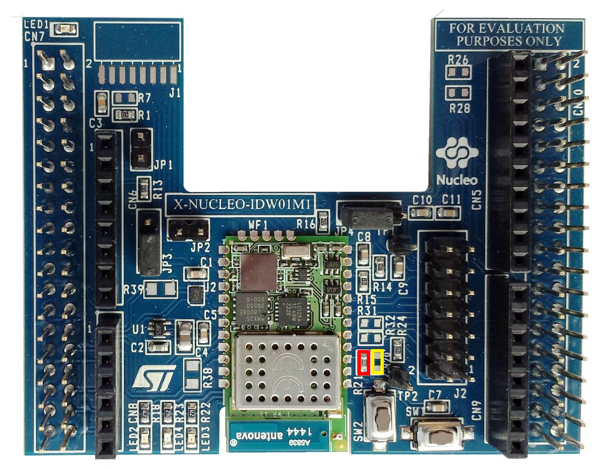

Affix the boards in the following order:  L476RG (Bottom) - IDW01M1 (Middle) - IKS01A1 (Top)

Download the latest binary (Verizon_ThingSpace_Client_v1.bin) from the Releases page in this repository.

Connect the Nucleo board to your computer via USB.  You will notice a hard drive (called NUCLEO, or NODE_L476) available.  

Open TeraTerm. Select “Serial” and choose the COM port that the NUCLEO device is connected to.

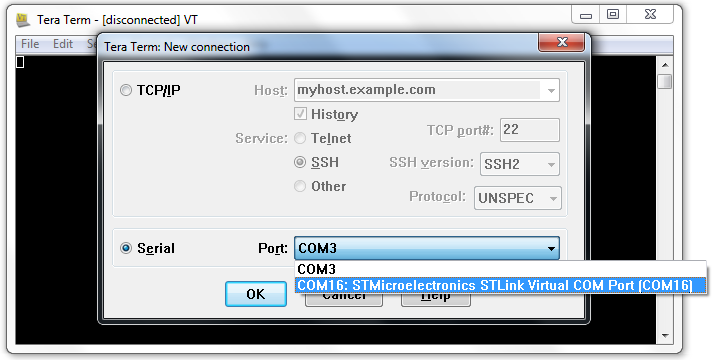

Select “Setup->Serial Port” and set the Baud rate to 115200, Data to 8 bit, Parity to none, Stop to 1 bit, Flow control to none.

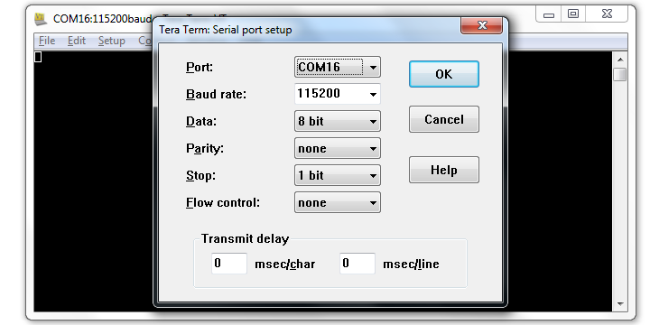

Select “Setup->Terminal” and check the Local echo box.

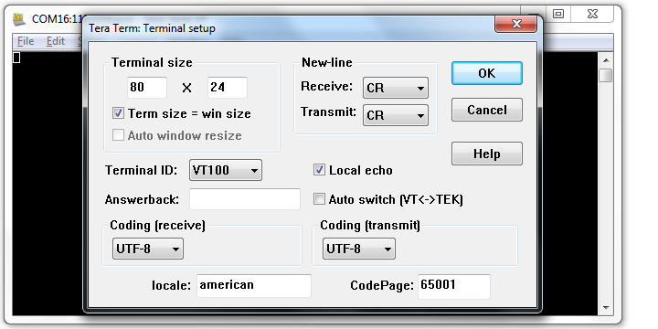

Drag the .bin file you downloaded into the main directory of the mounted Nucleo drive.

In TeraTerm, you will be prompted to enter the SSID, passkey, encryption mode and Thing name.  Choose a thing-name that is unique.

If you wish to modify these parameters again, reset the NUCLEO board while holding the BLUE user button.

If successful, you will now see the data being sent to Thingspace.io live in the terminal window.

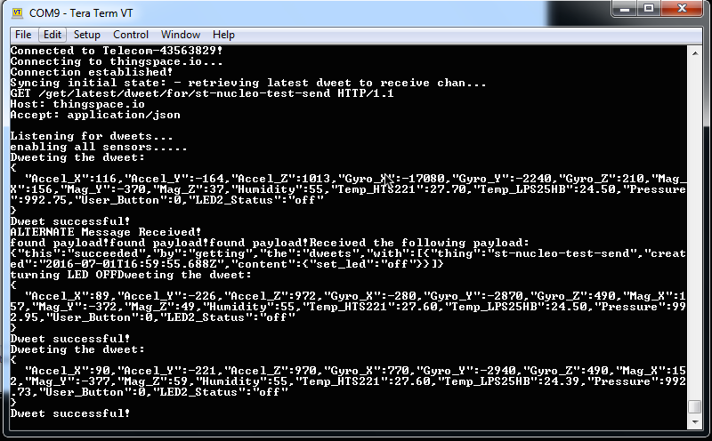

*For more information on the LaunchPad CC3200-LAUNCHXL, visit [http://www.st.com/content/st_com/en/products/evaluation-tools/product-evaluation-tools/mcu-eval-tools/stm32-mcu-eval-tools/stm32-mcu-nucleo/nucleo-l476rg.html](http://www.st.com/content/st_com/en/products/evaluation-tools/product-evaluation-tools/mcu-eval-tools/stm32-mcu-eval-tools/stm32-mcu-nucleo/nucleo-l476rg.html)

Demo Dashboard Usage
--------------------

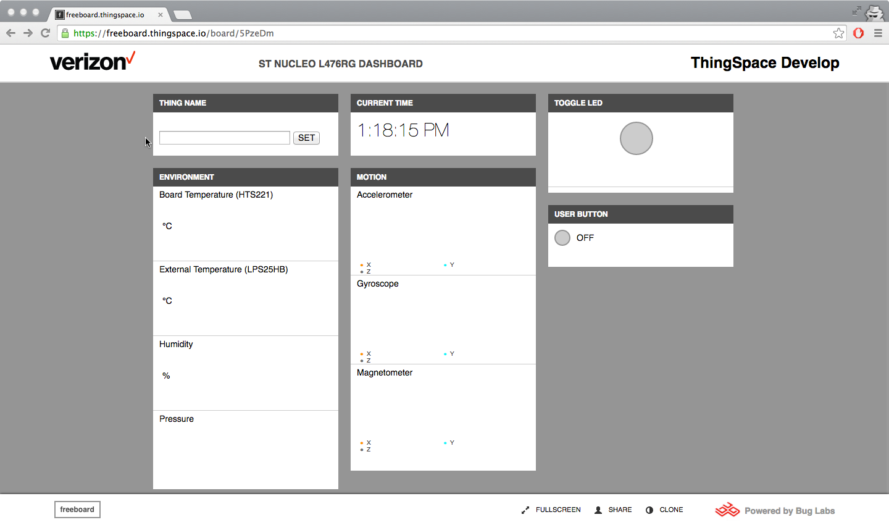
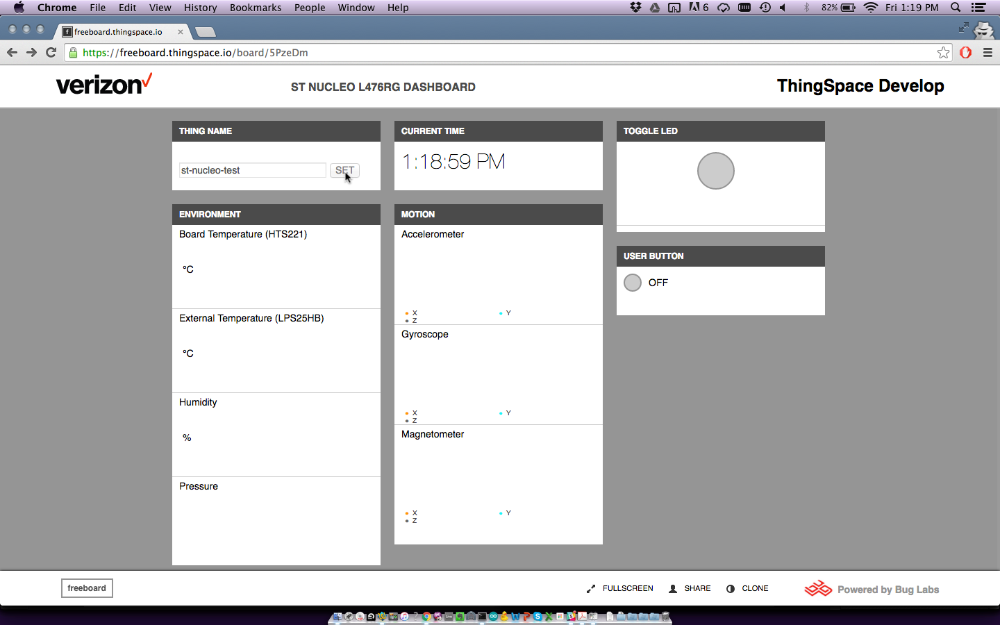
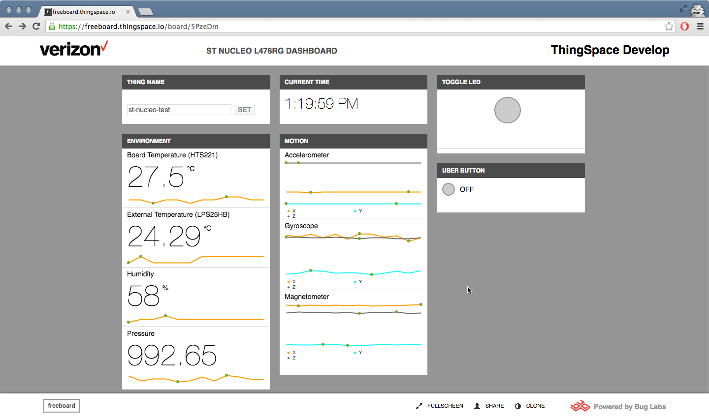
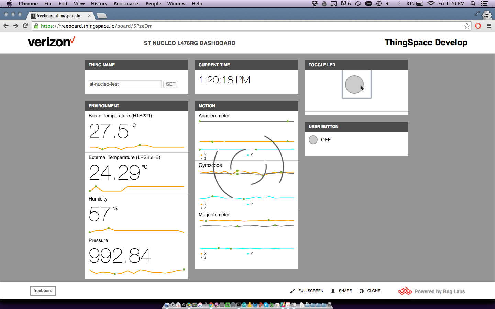

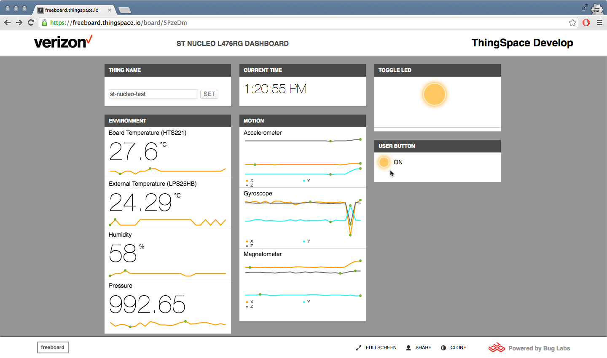

Customizing the Dashboard 
--------------------------
Sign-in to ThingSpace Develop: https://thingspace.verizon.com/developer/

Navigate to the Build page: https://thingspace.verizon.com/developer/build#/ 

Click Launch

Visit Dashboard: https://freeboard.thingspace.io/board/5PzeDm

Click Clone

Additional Resources
--------------------

Demonstration Dashboard: https://freeboard.thingspace.io/board/5PzeDm (you must login first before navigating here)

ST Nucleo documentation: http://www.st.com/content/st_com/en/products/evaluation-tools/product-evaluation-tools/mcu-eval-tools/stm32-mcu-eval-tools/stm32-mcu-nucleo/nucleo-l476rg.html

ThingSpace Home: https://thingspace.verizon.com/developer/

ThingSpace documentation: https://thingspace.verizon.com/developer/apis#/Dweet/index.html

Building Plugins: See http://freeboard.github.io/freeboard/docs/plugin_example.html for info on how to build plugins for freeboard.
