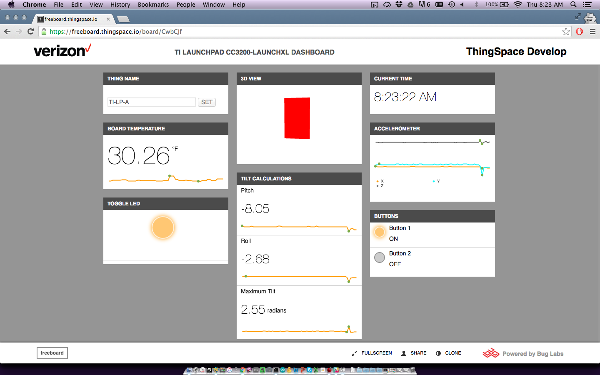
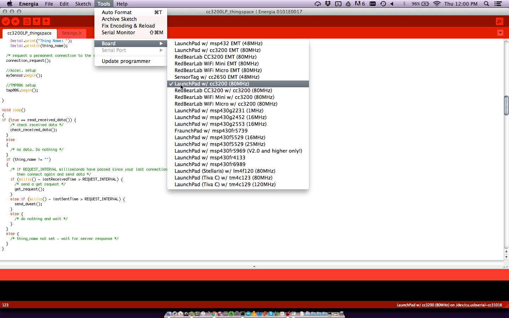
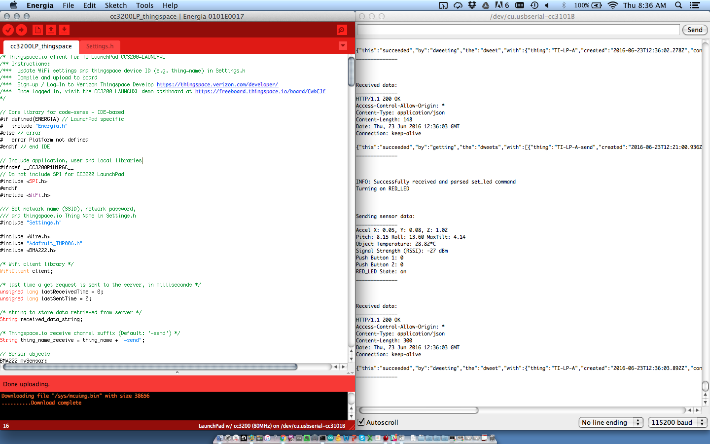

TI LaunchPad CC3200-LAUNCHXL for Thingspace.io
==============================================

Thingspace.io Client and Demo Dashboard for TI LaunchPad CC3200-LAUNCHXL

Demo Dashboard: [https://freeboard.thingspace.io/board/CwbCJf](https://freeboard.thingspace.io/board/CwbCJf)

# Table of Contents
*   [Introduction](#introduction)
*   [Programming the Board](#programming-the-board)
*   [Demo Dashboard Usage](#demo-dashboard-usage)
*   [Dashboard Customization](#customizing-the-dashboard)
*   [Additional Resources](#additional-resources)

Introduction
------------
This repository contains firmware and application code to view sensor data and send commands to TI's LaunchPad CC3200-LAUNCHXL board, using Verizon's ThingSpace Device Messaging APIs (thingspace.io) and ThingSpace-Freeboard application enablement tools.

The CC3200-LAUNCHXL connects via WiFi to send an assortment of on-board sensor data (including accelerometer, temperature, push buttons, tilt, and LEDs) to ThingSpace.  
You can view the live data and send commands to the board (including toggling the LED) from the Demo Dashboard ([https://freeboard.thingspace.io/board/CwbCJf](https://freeboard.thingspace.io/board/CwbCJf))

To get started, you must first program the board with your WiFi and thingspace.io settings.

Programming the Board
---------------------
  
Download Energia: http://energia.nu/download/

Follow the getting-started video to ensure the board's jumpers are properly set: https://youtu.be/Kn-YPsByyYU

Download and extract the latest client code: [https://github.com/buglabs/client-examples/releases/latest](https://github.com/buglabs/client-examples/releases/latest)

Open Energia, click File->Open, and choose the cc3200LP_thingspace.ino file.

The following project window will open, with two tabs - cc3200LP_thingspace.ino and Settings.h

Confirm that the Energia compiler is configured for our board

Click the Settings.h tab, choose a unique name for the board to set as the thingspace.io thing-name, and input your WiFi network SSID and password.  
NOTE: If a thing_name value in Settings.h is not set by the user, the board will automatically retrieve a temporary thing-name from the server.  You can obtain this temporary assignment by looking at the serial console (via Energia's Serial Monitor).  The server-assigned thing-name does NOT persist across power-cycles.

Click the check-mark icon on the top left to Verify/compile the code, then click the right-arrow icon to Upload/program the board
HINT: To program the board, you must have a jumper on J15.

If the programming process succeeds, remove jumper on J15 and reboot the board (push the RESET button on the board, or power-cycle).

Open the Serial Monitor in Energia to ensure connectivity and data is successfully sent and received

*For more information on the LaunchPad CC3200-LAUNCHXL, visit [http://energia.nu/pin-maps/guide_cc3200launchpad/](http://energia.nu/pin-maps/guide_cc3200launchpad/)

Demo Dashboard Usage
--------------------

[!dashboard_screen_shot](./doc_images/dashboard-1-default.png)
[!dashboard_set_thingname](./doc_images/dashboard-2-set_thingname.png)
[!dashboard_connected](./doc_images/dashboard-3-connected.png)
[!dashboard_toggle_led](./doc_images/dashboard-4-toggle_led.png)
[!dashboard_led_on](./doc_images/dashboard-5-led_on.png)
[!dashboard_live](./doc_images/dashboard-6-button_on.png)

Customizing the Dashboard 
--------------------------
Sign-in to ThingSpace Develop: https://thingspace.verizon.com/developer/
Navigate to the Build page: https://thingspace.verizon.com/developer/build#/ 
Click Launch
Visit Dashboard: https://freeboard.thingspace.io/board/CwbCJf
Click Clone

Additional Resources
--------------------
